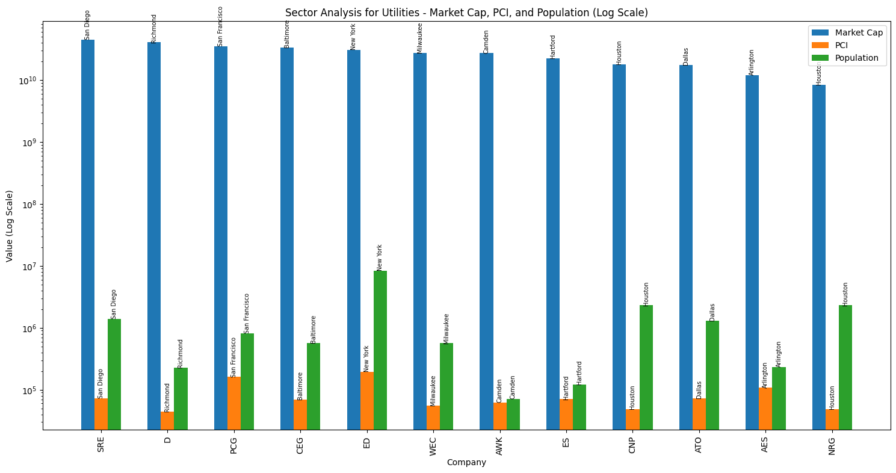

# What are some things that can affect returns of the S&P 500?

## Overview
In this project we dove into the dynamics that can influence returns of the S&P 500, particularly in the context of the volatile year of 2022.
We focused on a diverse range of factors, including company locations, market capitalization, population density, the Fear & Greed index, and overall stock performance metrics. 
Utilizing Python for sophisticated data analysis and visualization, we used Alpaca API to track and analyze these variables.
Our aim was to uncover potential correlations and patterns that could shed light on the factors driving stock market returns in one of the world's most watched indices.

## Technologies Used
- Python
- Pandas for data manipulation
- Matplotlib for Visualization
- Hvplots for Visualization
- Alpaca Trading API for Real World Data

## Installation
To set up the project environment:

1. Clone the repository  
```SSH: git@github.com:MontgomeryG/Group3Project1.git```

2. Install required dependencies:  
Run in Terminal  
```pip install pandas matplotlib hvplot python-dotenv alpaca-trade-api requests```

## Data Analysis and Visualization
In our project, we dove into the factors that may sway the S&P 500's performance during the 2022 market.  
We explored how the geographical location of company headquarters might relate to their stock returns, using geospatial visualizations to highlight this relationship. These visualizations served a dual purpose: they illustrated where companies are predominantly situated accross the United States and utilized a color scale to illustrate the performance of their stocks based on location.  
We accounted for the variance in stock prices, measuring in percentages to ensure that our analysis was accurate and not inadvertently skewed towards higher-priced stocks.
We further explored the market capitalization across different sectors, revealing inconsistencies in Marketcap when aligning with population— a factor we initially hypothesized to have a substantial impact on stock valuation.  
Additionally, we investigated into influences of external economic indicators, specifically the Bitcoin Fear & Greed Index, on the S&P 500. Our visualization included scatter plots and correlation heatmaps to visualize the strength and nature of this relationship. While our findings indicated a positive correlation in the heatmap and the plotted chart, the relationship overall was not robust enough to be consistently conclusive.  
Our project's strength was showcased through interactive visualizations that tracked daily percentage changes and closing prices, revealing detailed patterns in the market's behavior throughout 2022. These visualaztions not only demonstrated market's volatility but also highlighted our capability to discern subtle, yet insightful trends within S&P 500's financial data.  

### Key Visualizations
- Geoplots showing population versus stock returns.  

- Bar charts comparing companies metrics within sectors.  

- S&P 500 and Bitcoin Fear&Greed Index Charted plot and Correlation Heat Map.  
